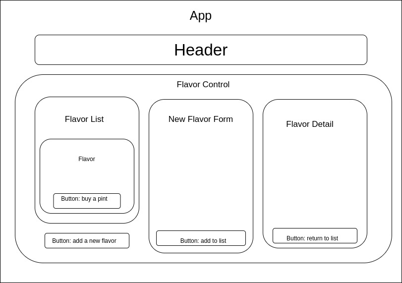

# Seltzer Bar

#### Created by Alma Frankenstein for Epicodus, 2020

## Description

Welcome to Jimbo's Seltzer Bar! This project demonstrates using shared and local state in a React app.

Users can purchase a pint of a particular flavor and add their own flavor to the list. Two default flavors are provided. If a user clicks on the name of a flavor in the list, they will be shown details about that flavor.

## Specs

* see a list of flavors
* for each flavor, see its name, brand, price, quantity, and description
* use a form to add a new flavor to the list
* click on a flavor to see its details
* diminish the quantity left, but not below zero

## Setup

To run on your localhost, clone this repo using:

```git clone https://github.com/alma-frankenstein/SeltzerBar seltzer```

cd to the seltzer directory.

Delete the 'node_modules' folder and the 'package-lock.json' folder, then run ```npm install``` to recreate them

Run ```npm start```


## Component Diagram

The diagram below shows the relationship between the components in this app. The FlavorControl holds the shared state for a flavor detail, the list of flavors, and the new flavor form, and determines which of them is showing.




## Technologies Used

* React
* JXS

# known bugs

If you try to start the app and get error 'ENOSPC: System limit for number of file watchers reached', try restarting your computer, or running the command ```echo fs.inotify.max_user_watches=524288 | sudo tee -a /etc/sysctl.conf && sudo sysctl -p```

## Contact Details

For questions or to suggestions, please email A.Q.Frankenstein@gmail.com

### License

This software is licensed under the MIT license.

Copyright (c) 2020 Alma Frankenstein